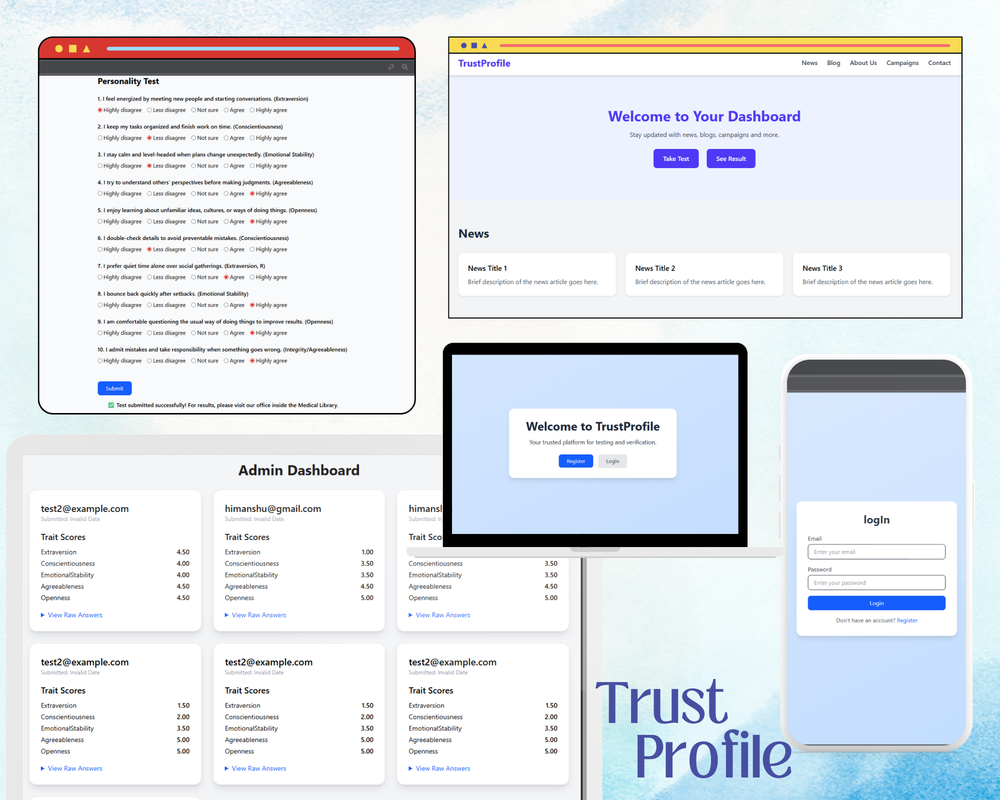

# 🔐 Trust Profile App

📌 Project Description

This website is built to allow users to take and submit personality tests online. The goal was to provide a secure and convenient platform for test submission while strictly following the client’s policy that users must not be able to view their own results online.

Key aspects:

📝 Online Test Submission – Users can register, log in, and securely submit their test answers.

🔒 Role-Based Authentication – Implemented with JWT; only admins can access and view results.

🚫 Restricted Result Access – Users cannot view results online. To get their report, they must visit the office offline.

⚡ Client Requirement Driven – The application was specifically built as per client demand to ensure secure, role-controlled result access.

🎨 Modern UI & UX – Built with React and Tailwind CSS for a clean, responsive user experience.

⚙️ Robust Backend – Node.js + Express + MongoDB handles authentication, data validation, and secure storage.

This website highly focuses on security


---

## 📸 Screenshots



---

## ✨ Features
- 🔑 User **Registration & Login** (JWT-based authentication)
- 👤 Role-based access control (Admin / User)
- 📊 Test submission with hidden results (for policy enforcement)
- ⚡ Modern **React UI** with Tailwind CSS
- 🔒 Secure API with Express and MongoDB
- 🚀 Scalable and extensible architecture

---

## 🛠️ Tech Stack
**Frontend:**
- React (Vite)
- React Router
- Tailwind CSS
- Axios

**Backend:**
- Node.js + Express
- MongoDB + Mongoose
- JWT Authentication
- Zod for validation

---

## 📂 Project Structure

frontend/ → React + Tailwind (UI)
backend/ → Express + MongoDB (API)


---

## ⚡ Installation & Setup

### 1️⃣ Clone the repo
```bash
git clone https://github.com/your-username/trust-profile-app.git
cd trust-profile-app

for frontend 
cd frontend
npm install
npm run dev

for backend 
cd backend
npm install
npx ts-node .\src\index.ts

👨‍💻 Author

Developed by Himanshu Jagtap (Raje) 🚀
